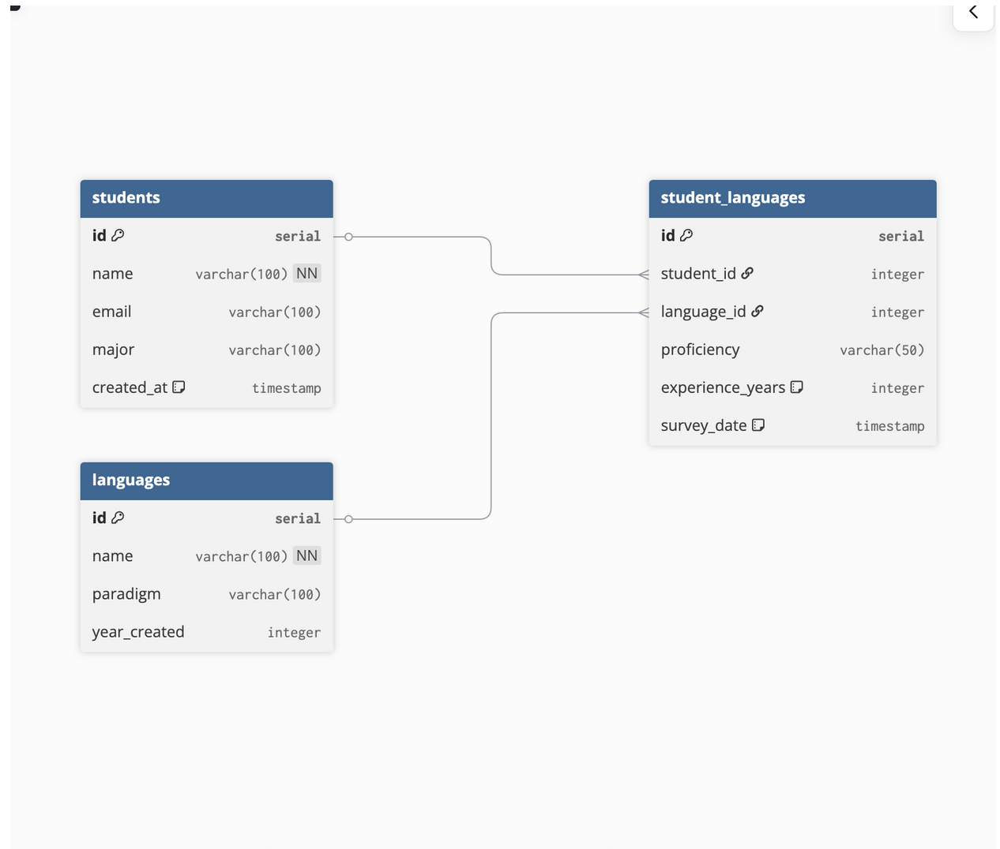

# Student Programming Language Survey System

Tracks which programming languages students know, their proficiency, and experience.

**ERD**: 

**Tables**:
- `students`: name, email, major
- `languages`: name, paradigm, year_created
- `student_languages`: links students + languages with proficiency, years, survey_date (many-to-many)

Live App: [your-streamlit-url]

How to run locally:
1. `pip install -r requirements.txt`
2. Create `.streamlit/secrets.toml` with your DB_URL
3. `streamlit run Home.py`